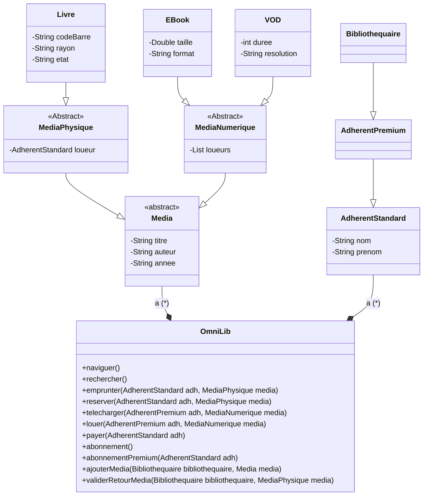

# OmniLib

## Diagramme case d'utilisation

## Diagramme de classes

```mermaid
classDiagram


class Media{
	<<abstract>>
	-String titre
	-String auteur
	-String annee	
}

class MediaNumerique{
	<<Abstract>>
	-List<AdherentStandard> loueurs
}

class MediaPhysique{
	<<Abstract>>
	-AdherentStandard loueur
}

class Livre{
	-String codeBarre
	-String rayon
	-String etat
}

class EBook{
	-Double taille
	-String format
}

class VOD{
	-int duree
	-String resolution
}

class AdherentStandard{
	-String nom
	-String prenom
}
class AdherentPremium
class Bibliothequaire

class OmniLib{
	+naviguer()
	+rechercher()
	+emprunter(AdherentStandard adh, MediaPhysique media)
	+reserver(AdherentStandard adh, MediaPhysique media)
	+telecharger(AdherentPremium adh, MediaNumerique media)
	+louer(AdherentPremium adh, MediaNumerique media)
	+payer(AdherentStandard adh)
	+abonnement()
	+abonnementPremium(AdherentStandard adh)
	+ajouterMedia(Bibliothequaire bibliothequaire, Media media)
	+validerRetourMedia(Bibliothequaire bibliothequaire, MediaPhysique media)
}

MediaPhysique --|> Media
MediaNumerique --|> Media
Livre --|> MediaPhysique
EBook --|> MediaNumerique
VOD --|> MediaNumerique

AdherentPremium --|> AdherentStandard
Bibliothequaire --|> AdherentPremium

Media --* OmniLib : a (*)
AdherentStandard --* OmniLib : a (*)
```

## Diagramme d'activité

